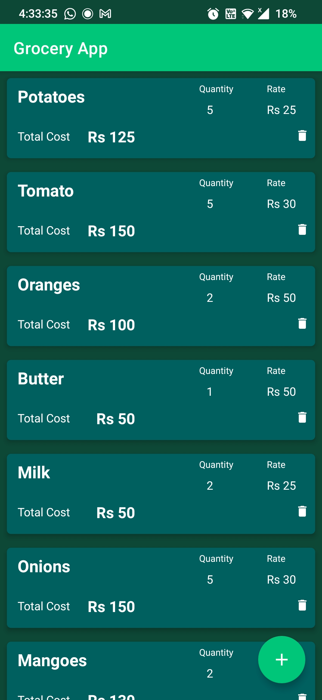
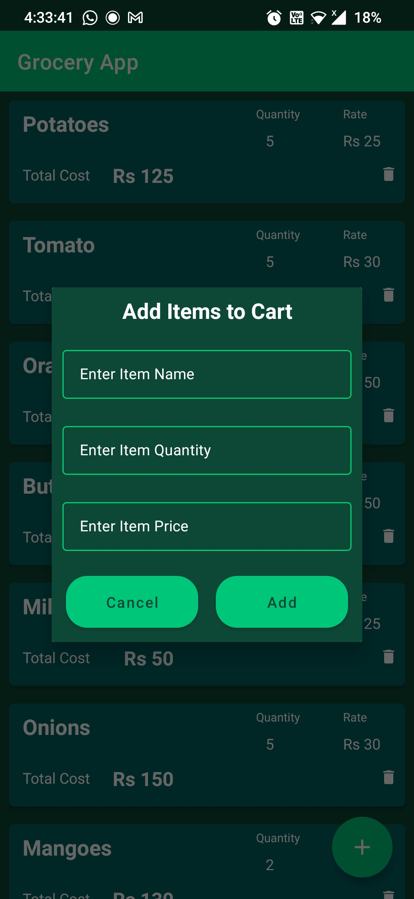

# SPSGP-75113-Virtual-Internship---Android-Application-Development-Using-Kotlin
## Grocery Application
This is a simple Grocery Application that allows you to create a list of grocery items to buy by utilizing Room library.
### ScreenShots

## Desciption
* Room is a persistent library in Android that allows fluent access to the database by creating an abstract layer over SQLite. It simplifies the process of adding a structured SQL database to your app. 
* The app allows to enter items in the grocery list, which takes in three variables - Item Name, Item Rate, and Item Quantity
* In case the values for mentioned variables are not entered, the app shows a toast asking for entering the values.
* In addition to these, user can also delete grocery items from the list

### Get the apk
[Click Here](https://github.com/smartinternz02/SPSGP-75113-Virtual-Internship---Android-Application-Development-Using-Kotlin/blob/master/Outputs/app-debug.apk)

## Demo Video
https://user-images.githubusercontent.com/92010969/190901791-a2a71357-969b-4dea-8247-2faa99acccf2.mp4

## Acknowledgement
I want to thank Mr. Ponnam for his guidance during the live session which made my initial journey with kotlin and android development easier. In addition to, this a huge thanks to Smartbridge for providing this great learning oppurtunity to us students
